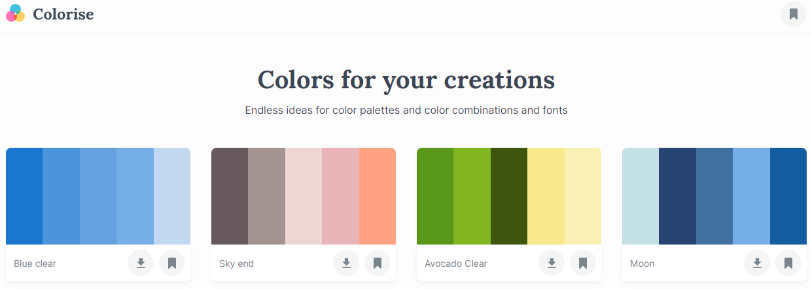

<h2 align="center">Colorise App (REACT JS)</h1>

  

    <a href="#sobre-o-projeto">Sobre o projeto</a>
    <a href="#funcionalidades">Funcionalidades</a>
  

<h2 align="center" id="sobre-o-projeto">Sobre o projeto</h2>

      Veja o projeto ao vivo
    </a>
  

 
Este projeto tem como principal objetivo estudar e aprimorar minhas habilidades com o React JS, uma das bibliotecas de desenvolvimento de interface de usuário mais populares e poderosas disponíveis atualmente.

Meu foco principal foi na criação de componentes reutilizáveis e interativos, utilizando e explorando as diversas funcionalidades do React, como o ciclo de vida dos componentes, state e props.

<h2 align="center" id="funcionalidades">Funcionalidades</h2>
<ul>
    <li>Usuário pode salvar e remover as paletas de cores favoritas</li>
    <li>Usuário pode copiar o código de cor passando com mouse sobre ela</li>
    <li>Usuário pode salvar a paleta de cores em um svg</li>
    <li>Usuário pode verificar as cores salvas</li>
    <li>Projeto é responsivo</li>
    <li>Cada cor pode ser exibida em uma pagina porpria com mais detalhes da cor</li>
    <li>Donwload em svg da paleta de cores</li>
</ul>

<h2 align="center">Contato e redes sociais</h2>
<ul>
    <li>
      <a href="https://www.linkedin.com/in/genilson-fernandes">Linkedin</a>
    </li>
    <li>
      Email - geniilsonfernandes@gmail.com
    </li>
</ul>
